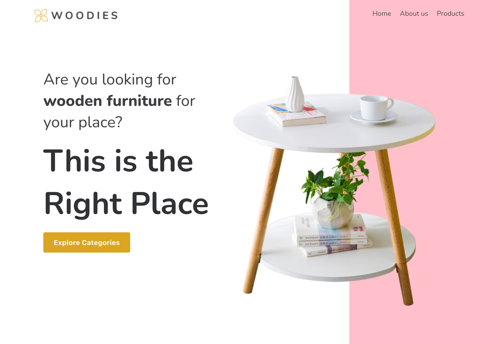
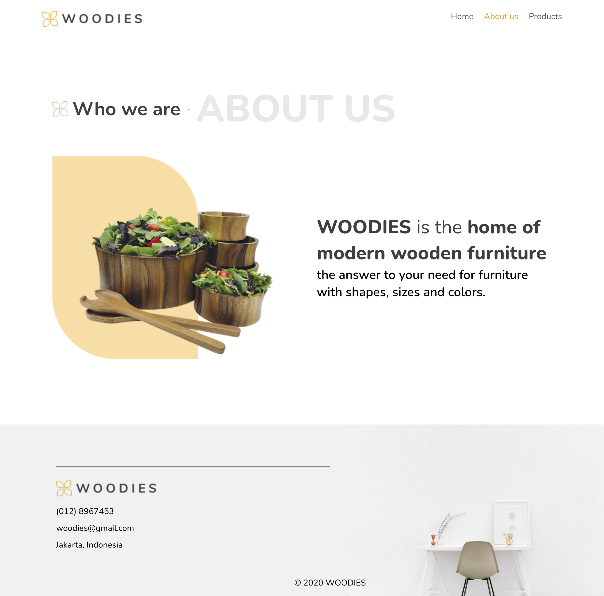
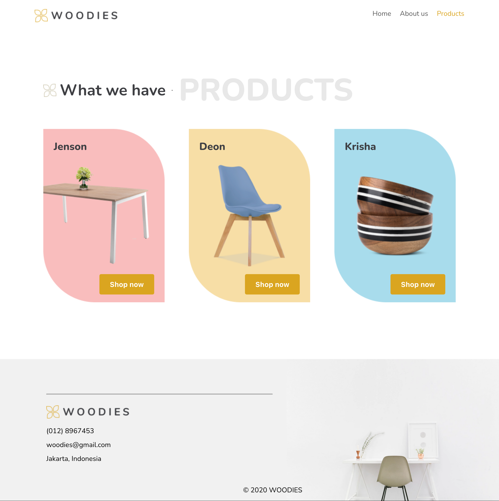
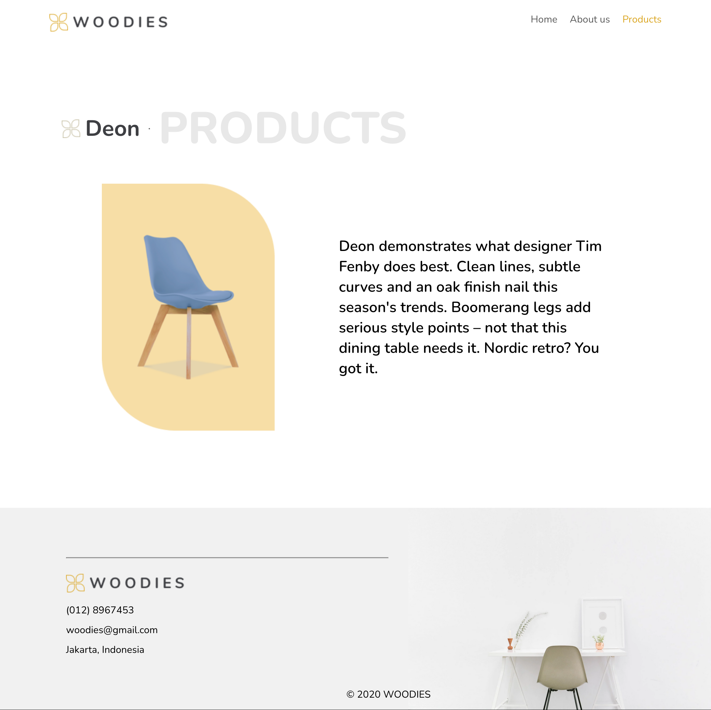

# woodies-furniture-shop-react-routes | Woodies Furnuture Shop

This project is build with React and uses Router DOM Package to learn how to build routes.

## Table of contents

- [Overview](#overview)
  - [The challenge](#the-challenge)
  - [Screenshot](#screenshot)
  - [Links](#links)
- [My process](#my-process)
  - [Built with](#built-with)
- [Author](#author)
- [Acknowledgments](#acknowledgments)

## Overview

### The challenge

The task is to create a website for an interiors company.

Uses React Router to allow navigation between the different subpages. For the project you have to create the following pages:

- Home
- About
- Categories
- jenson
- deon
- Krisha

### Screenshots

#### Home Screen

#### About Us Screen

#### Products Screen

#### Products Details Screen

### Links

- Solution URL: [https://github.com/jenniferhubermayer/woodies-furniture-shop-react-routes/](https://github.com/jenniferhubermayer/woodies-furniture-shop-react-routes/)
- Live Site URL: [https://delightful-bunny-a80668.netlify.app/](https://delightful-bunny-a80668.netlify.app/)

## My process

### Built with

- React App (using [React Router DOM Package](https://v5.reactrouter.com/))
- Semantic HTML5 markup
- CSS (desktop only)
- Flex
- JavaScript

## Author

- Website - [https://github.com/jenniferhubermayer](https://github.com/jenniferhubermayer)

## Acknowledgments

This project has been realized as part of the [super(c)ode](https://www.super-code.de/) "Front-End Boot-Camp 2022".
